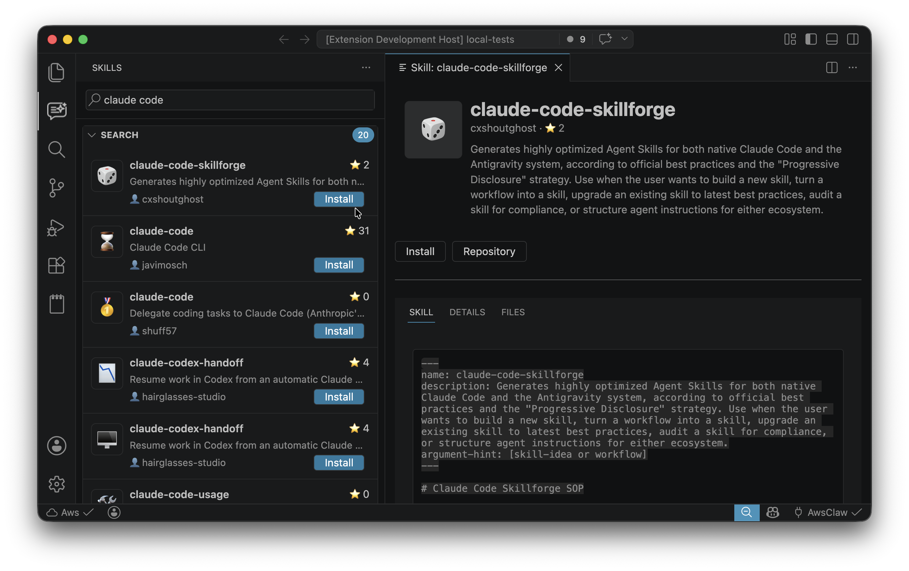

# AI Agent Skills

A Visual Studio Code extension to discover, inspect, install, and manage AI Agent Skills from [Skills Marketplace](https://skillsmp.com/) directly from the sidebar.

Supports Visual Studio Code and VS Code forks, including Antigravity, Windsurf, and Cursor.

## 🔑 Features

- **Marketplace Search**
  - Search skills from [skillsmp.com](https://skillsmp.com/)
  - Browse featured recommendations
  - Open rich details for each skill

- **Skill Detail Experience**
  - Dedicated detail panel with tabs: **Skill**, **Details**, **Files**
  - Render `SKILL.md` content when available
  - Browse repository/local files and preview text files

- **Install and Manage Skills**
  - Install per tool and scope (global or workspace)
  - Uninstall managed skills from the UI
  - Track installed skills in VS Code global storage

- **Managed + Unmanaged Visibility**
  - Managed skills include marketplace metadata
  - Unmanaged skills are discovered from non-standard locations
  - Both can appear under Global or Workspace sections

## 📂 Sidebar Layout

The AI Agent Skills view includes four main sections:

- **Search**: Discover skills from the marketplace
- **Global**: Skills installed in global locations for the current host editor
  - Managed skills: full metadata and uninstall actions
  - Unmanaged skills: muted visuals, basic metadata
- **Workspace**: Skills installed in workspace scope
  - Includes both managed and unmanaged skills
- **Recommended**: Featured skills from the marketplace

## 🧩 Skill Detail Panel

Clicking a skill opens a full detail panel:

- **Skill**: Displays `SKILL.md` source content when present
- **Details**: Marketplace and installation metadata
- **Files**: Browse directories and preview supported text files

The Files view starts from the best available skill path.

## ⚙️ Installation Modes

Skills can be installed in two modes.

### Global Installation

- Installed under the host editor's default extension/skills location
- Available across all workspaces
- Supported targets:
  - Common location: `~/.agents/skills`
  - VS Code: `~/.copilot/skills`
  - Cursor: `~/.cursor/skills`
  - Windsurf: `~/.codeium/windsurf/skills`
  - Antigravity: `~/.gemini/antigravity/skills`

### Workspace Installation

- Installed under a tool-specific project directory in the current workspace (for example `.agents/skills/`, `.windsurf/skills/`, or `.claude/skills/`)
- Available only in that workspace
- Useful for team/project-scoped skill sets

## 🔍 Managed vs Unmanaged Skills

### Managed Skills

- Installed through AI Agent Skills marketplace flows
- Tracked in VS Code global storage
- Include marketplace metadata (author, version, stars)
- Uninstallable from the extension UI

### Unmanaged Skills

- Discovered from alternative/non-standard locations
- Not tracked as marketplace-managed installs
- Shown with muted styling for quick visual distinction
- Useful for local, team-shared, or experimental skills

## 💖 Sponsor & Feedback

- **Report issues or request features**: [GitHub Issues](https://github.com/necatiarslan/skills-vscode-extension/issues)
- **Support the project**: [GitHub Sponsors](https://github.com/sponsors/necatiarslan)

## 🚀 Roadmap

- Workspace-aware recommendations

## 📬 Stay in Touch

- Author: Necati ARSLAN (necatia@gmail.com)
- LinkedIn: https://www.linkedin.com/in/necati-arslan/

Enjoy! 🚀